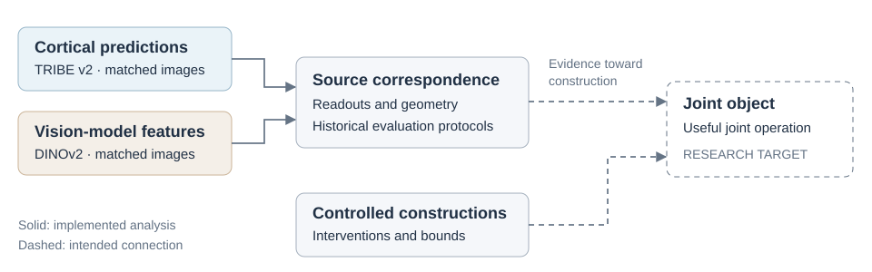
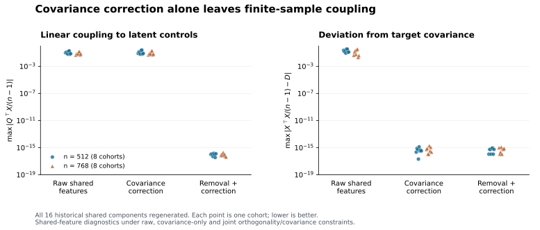

# Genesis

Research software for constructing representations for learning systems under
neural-derived and vision-model constraints. The intended object is a representation whose
geometry retains useful structure from both sources and supports operations
that neither source supplies alone. This repository implements foundations for
that object: source analysis, controlled constructions, and numerical bounds.

For the same $n$ images, let $N\in\mathbb{R}^{n\times d_N}$ contain
TRIBE-v2-predicted cortical features and $M\in\mathbb{R}^{n\times d_M}$ contain
DINOv2 features, with rows matched by stimulus. Constructing a joint object $Z$
requires preserving distinct source structure, controlling the construction,
and establishing its properties under finite-sample and numerical effects.



The neural features are model predictions learned from human recordings,
providing the neural-derived constraints for construction.

## Source correspondence

The first empirical question is whether information remains recoverable across
the source geometries. With training-standardized predictors $X$ and
training-normalized targets $Y$, the ridge readout predicts held-out rows:

$$
K=\frac{XX^\top}{p},\qquad
\widehat{Y}_q=\frac{X_qX^\top}{p}(K+\alpha I)^{-1}Y.
$$

Here $p$ is the retained predictor count, $X_q$ contains the held-out predictors,
and $\alpha$ is selected inside the training partition. A prediction is scored
by whether the matching image ranks ahead of the distractors. The discovery
study reached **95.57% Top-1** over 768 held-out image queries, each with 16
candidates from the same dataset-origin group (COCO, ImageNet or Scene).
Distractors could include training images. The result establishes recoverable
matching-image information across the two source geometries.

The [discovery readout](src/genesis_core/readout_discovery.py) and
[matched-64-image readout](src/genesis_core/readout_matched.py) implement distinct
historical protocols. The `records` command reproduces all **330 saved
matched-readout summary comparisons** from the fold measurements. Matrix-level
replay requires the original feature arrays, which are outside this package.

## Controlling finite-sample coupling

A controlled source family exposes a construction problem: nonlinear features
designed to have vanishing linear moments at population level can acquire
coupling to the latent coordinates in a finite sample. Covariance restoration
leaves this coupling intact. The intervention below enforces orthogonality
and a covariance target declared before observing the sample.

Let $S\in\mathbb{R}^{n\times d}$ be centered shared features and
$Q\in\mathbb{R}^{n\times k}$ the centered latent controls. Remove the component
explained by those controls, then restore the declared diagonal covariance $D$:

$$
B=\arg\min_B\|S-QB\|_F^2,\qquad R=S-QB,
$$

$$
C=\frac{R^\top R}{n-1},\qquad T=RC^{-1/2}D^{1/2}.
$$

For full-column-rank $Q$ and positive-definite $C$ and $D$, this gives two
properties together in exact arithmetic:

$$
Q^\top T=0,\qquad \frac{T^\top T}{n-1}=D.
$$

The [implementation](src/genesis_core/intervention.py) solves the least-squares
problem, checks conditioning, and computes the covariance transform. Run
`python -m genesis_core construction` to regenerate all **16 historical shared
components** at $n=512$ and $768$, including both comparison methods:



Each point is one regenerated cohort. The left panel measures the largest
absolute entry of $Q^\top T/(n-1)$; the right measures covariance error relative
to $D$. The raw and covariance-only variants use their respective feature
blocks in place of $T$. The figure isolates the shared component of the
construction. [Figure code](examples/plot_construction.py) uses the same public
construction function.

The saved full-source experiments also expose the trade-off: at carrier mass
0.02, across-cohort agreement standard deviation fell **37.4% / 42.9%** at
$n=512 / 768$, while mean agreement fell too. The `records` command reaggregates
all 192 saved agreement measurements. A separate cell-removal comparison
reconstructs 120 paired deltas: micro-scale effects fell by **0.00717–0.00733**,
while mean mesoscopic changes stayed near zero, with nonzero individual changes.
These results identify specific controls and their costs. At $n=256$, incomplete
gate success led to a separately validated construction branch.

## Bounds over a parameter interval

Qualification also requires controlling spectral concentration. For nonzero
centered features with singular values $\sigma_i$, entropy effective rank is

$$
p_i=\frac{\sigma_i^2}{\sum_j\sigma_j^2},\qquad
r_{\mathrm{eff}}=\exp\!\left(-\sum_i p_i\log p_i\right).
$$

The difficulty is bounding the expectation of this nonlinear statistic after
sample centering and random trace normalization, uniformly over a parameter
interval. The bound must also account for the estimator's small-weight cutoff.

For the selected ideal marginal model, the [rational bound engine](src/genesis_core/entropy.py)
accounts for sample centering, random trace normalization, and the cutoff.
At sample size 4096 it establishes

$$
\mathbb{E}[r_{\mathrm{eff}}(N_u)]\geq 5.23,\qquad
\mathbb{E}[r_{\mathrm{eff}}(M_u)]\geq 24.1,
\qquad |u|\leq\frac{1}{4096}.
$$

Here $N_u$ and $M_u$ denote samples from the ideal source marginals, distinct
from the empirical feature matrices above. Convexity reduces the varying
logarithmic term to endpoint bounds; rational arithmetic encloses those terms.
The `qualification` command runs this calculation, checks 2,048 saved interval
leaves and 96 ridge bounds, and verifies error comparisons for four captured
singular-value executions. The [technical note](docs/TECHNICAL_NOTE.md) gives
the derivation, assumptions, and scope of each check.

## Run the work

Python 3.11+. Tested with Python 3.12.10, NumPy 2.3.5, SciPy 1.16.2 and
scikit-learn 1.8.0. From this repository:

```sh
python -m pip install -e .
python -m genesis_core construction
python -m genesis_core records
python -m genesis_core qualification
python -m unittest discover -s tests -v
```

These bounded examples run locally without model downloads or network access
after dependency installation. They print results without changing research
data. Add `--json` for structured output. Floating-point checks use declared
tolerances; rational comparisons use exact integer arithmetic. To regenerate
the figure, install the optional plotting dependency:

```sh
python -m pip install -e ".[figures]"
python examples/plot_construction.py
```

## Analyze your own matched arrays

The estimators accept paired feature matrices with the same stimuli in the
same row order; feature dimensions may differ between sources. Integer category
labels supply the category-distance control for partial RSA and define candidate
groups for the readout. In the historical discovery study these were dataset
origins (COCO, ImageNet and Scene).

For a geometry analysis, center each feature bank and normalize its rows before
computing cosine distances:

```python
import numpy as np
from genesis_core.analysis import (
    cosine_distance, l2_rows, partial_rsa, spectral_metrics,
    neighborhood_overlap,
)

x = np.load("source.npy", allow_pickle=False)
y = np.load("target.npy", allow_pickle=False)
labels = np.load("categories.npy", allow_pickle=False)

dx = cosine_distance(l2_rows(x - x.mean(axis=0)))
dy = cosine_distance(l2_rows(y - y.mean(axis=0)))
print(partial_rsa(dx, dy, labels))
print(neighborhood_overlap(dx, dy, k=5))
print(spectral_metrics(x))
print(spectral_metrics(y))
```

Partial RSA compares distance ranks after removing the category-distance effect;
neighborhood overlap measures shared nearest neighbors; spectral metrics report
entropy, participation and stable rank, plus mean pairwise cosine. These are
full-bank descriptive measurements. For held-out prediction, preprocessing must
be fitted within each training fold. The nested discovery readout handles that
separation, with adequate samples per category:

```sh
python -m genesis_core analysis --source source.npy --target target.npy --categories categories.npy
```

This uses the discovery protocol and its recorded configuration. Historical
replay additionally requires the original matrices, identities and task seeds;
`--seed` supplies an evaluation seed; the default is the recorded configuration's
master seed. `analysis --demo` is an explicitly synthetic interface example.
The historical matched-64-image protocol is separately available through
`genesis_core.readout_matched.evaluate` and uses a different candidate universe.
See the [methods note](docs/TECHNICAL_NOTE.md) for protocol details and input
requirements.

## Code map

| Module | Mathematical role |
|---|---|
| [analysis.py](src/genesis_core/analysis.py) | Distances, spectral measures, neighborhood overlap and trained readouts |
| [readout_matched.py](src/genesis_core/readout_matched.py) / [readout_discovery.py](src/genesis_core/readout_discovery.py) | Separate historical evaluation protocols |
| [charts.py](src/genesis_core/charts.py) | Generate the bounded shared-feature construction |
| [intervention.py](src/genesis_core/intervention.py) | Remove linear coupling and restore covariance |
| [entropy.py](src/genesis_core/entropy.py) | Bound expected ideal-marginal entropy rank with rational arithmetic |
| [intervals.py](src/genesis_core/intervals.py) / [qualification.py](src/genesis_core/qualification.py) | Check saved interval coverage and captured singular-value errors |
| [experiments.py](src/genesis_core/experiments.py) | Regenerate constructions and compare historical measurements |

## Scope and provenance

The research has established a positive controlled source-pair qualification
case. This release provides executable methods for source analysis, construction and
numerical bounds. Building a joint representation from the real sources and
demonstrating a useful operation are the next research objectives. Isolating
the contribution of neural training requires comparison with the neural model's
upstream visual representation.

The release adds explicit self-exclusion and invalid-input guards to its copy
of the analysis code. Frozen lab implementations and records retain their
historical definitions. [PROVENANCE.json](PROVENANCE.json) records the scientific
snapshot and source and exported-file identities; `python verify.py` checks
file integrity. The [methods note](docs/TECHNICAL_NOTE.md#reproduction-scope)
describes the packaged evidence and dependencies for fuller reproduction.

Licensed under [Apache 2.0](LICENSE). Third-party models, weights and datasets
retain their respective terms.
